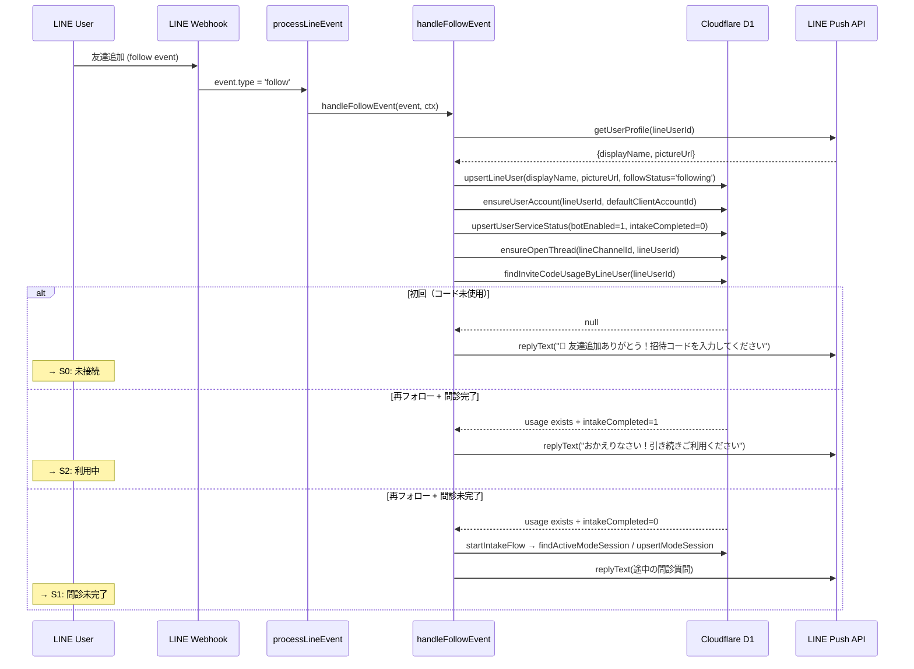
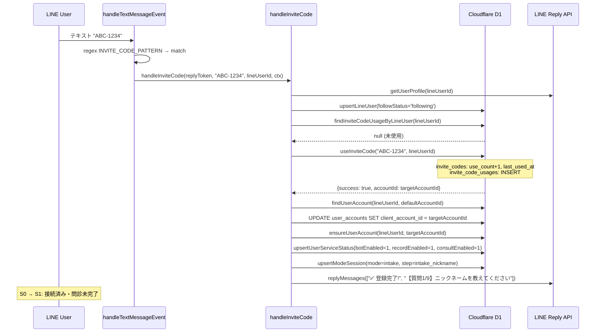
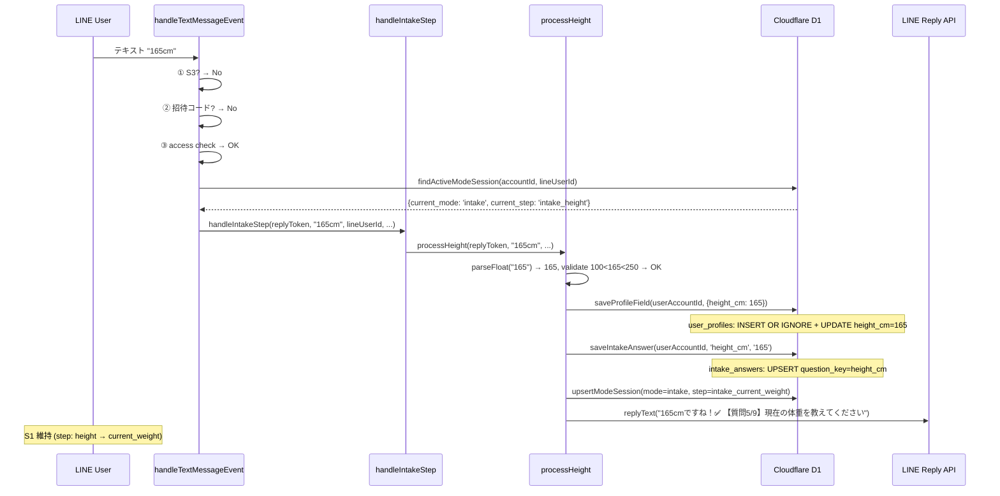
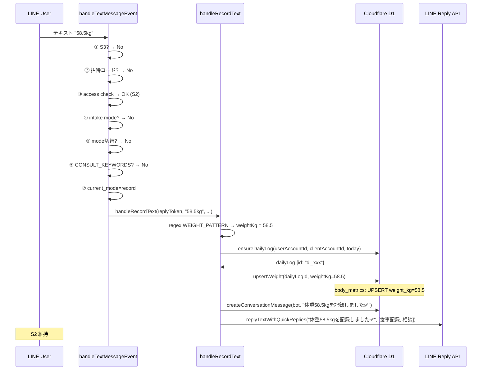
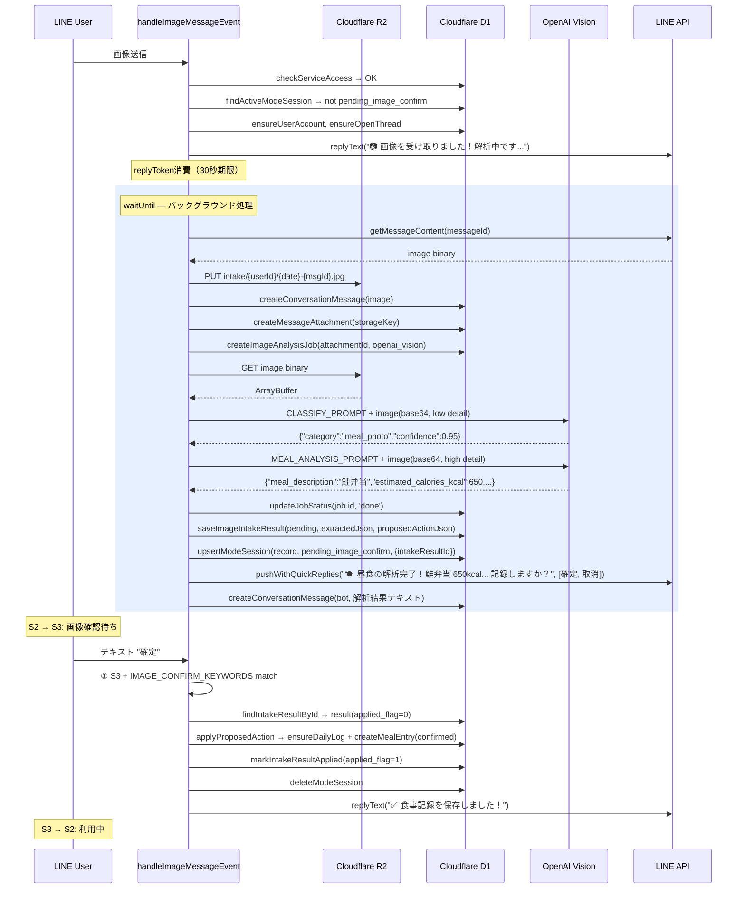
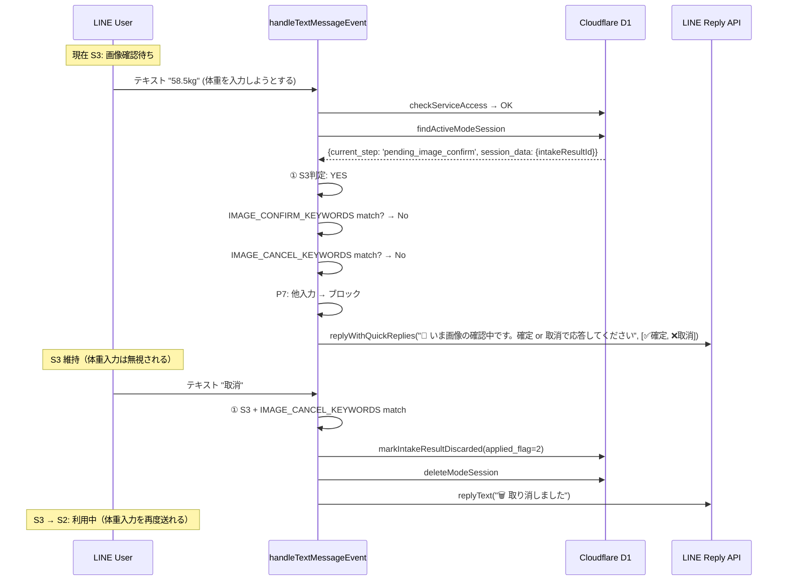
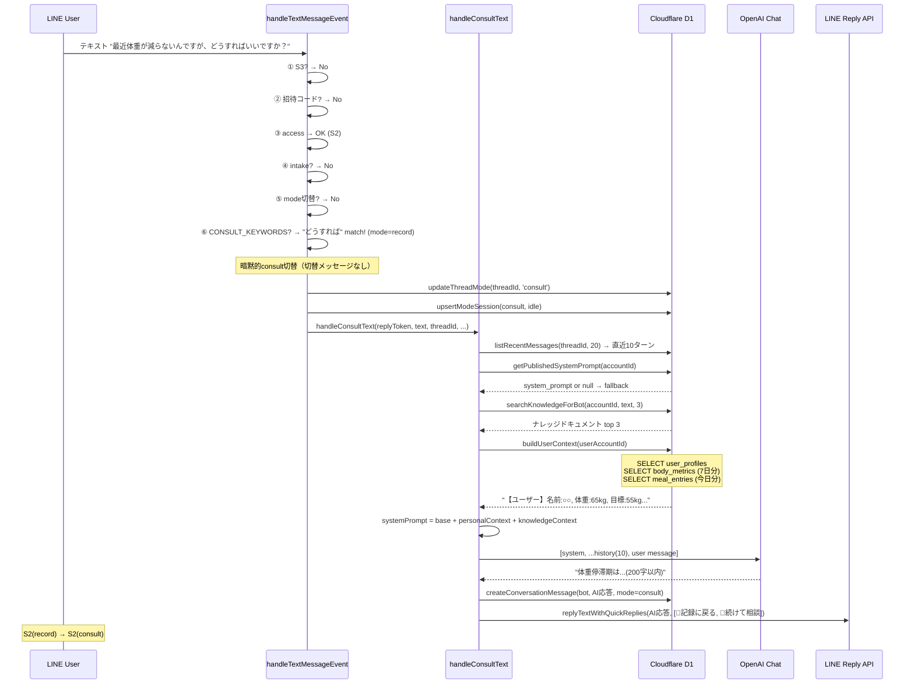
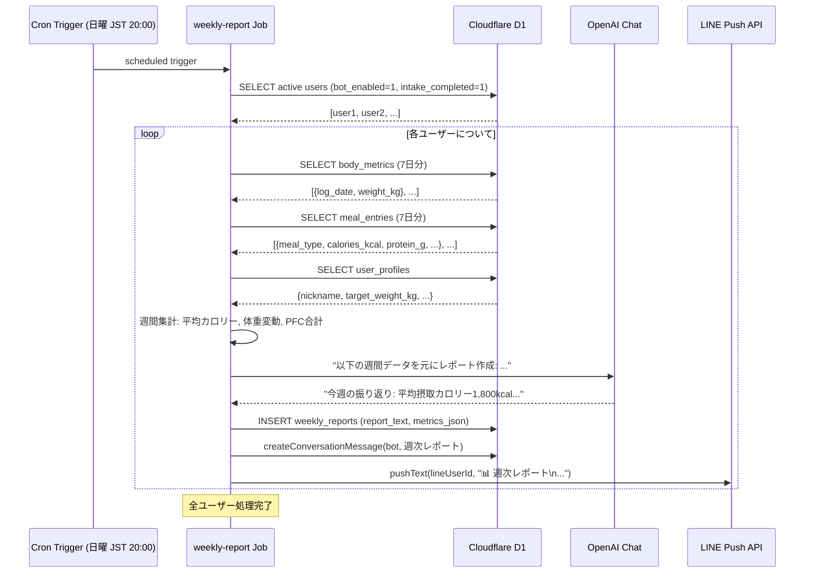

# diet-bot LINE 運用フロー・画面要件 SSOT

> **最終更新**: 2026-03-12 v3.0  
> **対象**: diet-bot v1.2.1  
> **正本宣言**: このドキュメントが LINE BOT 会話設計の唯一正本（SSOT）です。  
> コード変更時はまずこのドキュメントを更新し、コードをドキュメントに合わせること。  
> 旧版 `docs/05_LINE会話フローSSOT.md` を置き換えます。

---

## 目次

- [0. 設計原則](#0-設計原則7項目)
- [1. ユーザー SSOT 状態](#1-ユーザー-ssot-状態5-状態)
- [2. メッセージ処理優先順位](#2-メッセージ処理優先順位不変ルール)
- [3. 3レーン設計](#3-3-レーン設計)
- [4. AI vs 決定論的ロジック境界定義](#4-ai-vs-決定論的ロジック境界定義)
- [5. 接続フロー（LANE 1）](#5-接続フローlane-1詳細)
- [6. 問診フロー（LANE 2）](#6-問診フローlane-2詳細--9-問ステートマシン)
- [7. 記録フロー（LANE 3 record）](#7-記録フローlane-3-record)
- [8. 画像確認待ち状態（S3）](#8-画像確認待ち状態s3-ブロッキングルール)
- [9. 相談フロー（LANE 3 consult）](#9-相談フローlane-3-consult)
- [10. 入力分岐テーブル（完全版 SSOT）](#10-入力分岐テーブル完全版-ssot)
- [11. キーワード・正規表現一覧](#11-キーワード正規表現一覧実装値)
- [12. DB テーブル更新マップ（イベント別完全版）](#12-db-テーブル更新マップイベント別完全版)
- [13. シーケンス図（8 コアイベント）](#13-シーケンス図8-コアイベント)
- [14. 管理者・スーパーアドミン画面スコープ](#14-管理者スーパーアドミン画面スコープ)
- [15. Cron ジョブ一覧](#15-cron-ジョブ一覧)
- [16. 実装タスク優先順位](#16-実装タスク優先順位)
- [17. 変更履歴](#17-変更履歴)

---

## 0. 設計原則（7項目）

| # | 原則 | 説明 |
|---|------|------|
| P1 | **非ブロッキングフロー** | ユーザーが操作不能になる状態を最小限に。画像確認待ち以外はいつでもモード切替可能 |
| P2 | **決定論的ステートマシン** | 招待コード検証・問診進行・モード切替・確定取消判定は AI 不使用。正規表現・キーワード・DB 状態のみ |
| P3 | **AI 使用箇所の限定** | OpenAI は画像解析（分類+栄養推定）、栄養コメント生成、相談応答、週次レポート要約の 4 用途のみ |
| P4 | **1 ユーザー = 1 アカウント不変** | 最初の招待コード使用でアカウント紐付け確定。以降は変更不可 |
| P5 | **replyToken は 1 回限り** | 同一イベントでの reply は 1 回。追加送信は push を使用 |
| P6 | **問診は常に現在の質問を返す** | 「続けますか？」等の確認を挟まない。質問番号と質問文のみを返す |
| P7 | **画像確認待ち中は他入力ブロック** | 確定/取消以外のテキストには「いま画像確認中です」と返す。モード切替も不可 |

---

## 1. ユーザー SSOT 状態（5 状態）

| 状態 | コード | 判定条件 | 利用可能機能 |
|------|--------|----------|-------------|
| **S0: 未接続** | `no_access` | `invite_code_usages` に記録なし | 招待コード入力のみ |
| **S1: 接続済み・問診未完了** | `intake_pending` | `invite_code_usages` あり + `intake_completed = 0` | 問診回答のみ |
| **S2: 利用中** | `active` | `intake_completed = 1` + `bot_enabled = 1` | 全機能（記録・相談・画像・LIFF） |
| **S3: 画像確認待ち** | `pending_image` | `bot_mode_sessions.current_step = 'pending_image_confirm'` | 確定/取消のみ |
| **S4: 停止中** | `suspended` | `bot_enabled = 0`（admin が停止） | なし（停止メッセージのみ表示） |

### 1.1 状態遷移図

```
  友達追加
     │
     ▼
   ┌────┐  招待コード成功   ┌────┐  問診完了   ┌────┐
   │ S0 │ ──────────────→ │ S1 │ ────────→ │ S2 │
   └────┘                 └────┘           └────┘
     ▲                      ▲               │ ▲
     │                      │ 問診やり直し   │ │
     │                      └───────────────┘ │
     │                                        │
     │                    画像送信(解析完了)    │ 確定/取消
     │                    ┌────┐               │
     │                    │ S3 │ ──────────────┘
     │                    └────┘
     │                      ▲ │
     │                      │ │ 24hタイムアウト(→S2)
     │                      └─┘
     │
     │  admin停止    ┌────┐
     └───────────── │ S4 │ ←── admin停止（S0/S1/S2/S3 どこからでも遷移可）
                    └────┘
```

### 1.2 状態判定フローチャート

```
checkServiceAccess(accountId, lineUserId)
  │
  ├─ NULL or botEnabled=0 → S4:停止中 / S0:未接続
  │
  ├─ botEnabled=1 + intakeCompleted=0 → S1:問診未完了
  │
  └─ botEnabled=1 + intakeCompleted=1
       │
       └─ findActiveModeSession()
            │
            ├─ current_step='pending_image_confirm' → S3:画像確認待ち
            │
            └─ else → S2:利用中
```

---

## 2. メッセージ処理優先順位（不変ルール）

テキストメッセージ受信時、以下の順序で**上から順に評価**し、最初にマッチした処理を実行して return する。**順序変更禁止**。

| 優先度 | 処理 | 評価条件 | AI | 状態制約 | ソースコード行 |
|--------|------|----------|:--:|----------|---------------|
| **①** | 画像確認待ち応答 | `session.step = 'pending_image_confirm'` | ❌ | S3 のみ | `process-line-event.ts` L313-345 |
| **②** | 招待コード | regex `/^[A-Z]{3}-\d{4}$/i` | ❌ | 全状態（最優先認証処理） | L351-361 |
| **③** | サービスアクセス確認 | `checkServiceAccess()` 失敗 → 「招待コード入力を」| ❌ | S0 → ブロック | L366-370 |
| **④** | 問診途中 | `mode = 'intake'` | ❌ | S1 のみ | L400-413 |
| **⑤** | モード切替コマンド | キーワード完全/部分一致 | ❌ | S2 | L420-461 |
| **⑥** | 相談キーワード自動切替 | `CONSULT_KEYWORDS` 部分一致 | ✅ | S2(record) | L468-481 |
| **⑦** | 体重記録 / 食事テキスト / 相談テキスト | mode に応じて振り分け | mixed | S2 | L486-491 |

画像メッセージの優先順位:

| 優先度 | 処理 | 条件 | AI |
|--------|------|------|:--:|
| **I-①** | 画像確認待ちブロック | `session.step = 'pending_image_confirm'` → ブロック | ❌ |
| **I-②** | アクセス確認 | access NG → ブロック | ❌ |
| **I-③** | 画像受信→解析→確認 | access OK | ✅ |

---

## 3. 3 レーン設計

### LANE 1: 接続（Connection）— AI 不使用

```
友達追加 → 招待コード入力促進 → コード認証 → アカウント紐付け
```

**DB テーブル**: `line_users`, `user_accounts`, `user_service_statuses`, `invite_codes`, `invite_code_usages`

### LANE 2: 問診（Hearing）— AI 不使用

```
Q1(nickname) → Q2(gender) → Q3(age_range) → Q4(height) → Q5(weight) → Q6(target) → Q7(goal) → Q8(concerns) → Q9(activity) → 完了
```

**DB テーブル**: `user_profiles`, `intake_answers`, `body_metrics`(Q5), `bot_mode_sessions`, `user_service_statuses`(完了フラグ)

### LANE 3: 運用（Operation）

| サブレーン | AI使用 | 説明 |
|-----------|:------:|------|
| record(体重テキスト) | ❌ | 正規表現で検出、即DB書込 |
| record(食事テキスト) | ❌ | キーワード分類、即DB書込 |
| image(食事写真) | ✅ | OpenAI Vision → 確定/取消 → DB書込 |
| image(体重計) | ✅ | OpenAI Vision → 確定/取消 → DB書込 |
| image(進捗写真) | ✅ | OpenAI Vision分類 → 確定/取消 → DB書込 |
| consult | ✅ | OpenAI Chat + RAG + ナレッジ + 個人コンテキスト |
| cron(リマインダー) | ✅ | パーソナライズ文面生成 |
| cron(週次レポート) | ✅ | 集計 → AI要約 |

---

## 4. AI vs 決定論的ロジック境界定義

### 4.1 AI 使用箇所（OpenAI のみ）

| # | 用途 | モデル | temp | 入力 | 出力形式 | ソースファイル |
|---|------|--------|------|------|----------|---------------|
| A1 | 画像カテゴリ分類 | Vision | 0.2 | 画像(base64) | JSON `{category, confidence}` | `jobs/image-analysis.ts` |
| A2 | 食事写真 栄養推定 | Vision | 0.2 | 画像(base64) | JSON `{meal_description, calories_kcal, ...}` | `jobs/image-analysis.ts` |
| A3 | 栄養ラベル読取 | Vision | 0.2 | 画像(base64) | JSON `{product_name, calories_kcal, ...}` | `jobs/image-analysis.ts` |
| A4 | 体重計数値読取 | Vision | 0.2 | 画像(base64) | JSON `{weight_kg, unit}` | `jobs/image-analysis.ts` |
| A5 | 相談応答 | Chat | 0.7 | テキスト + 履歴 + ナレッジ + 個人コンテキスト | テキスト(200字以内) | `process-line-event.ts` |
| A6 | 栄養コメント生成 | Chat | 0.7 | 食事記録 + PFC値 | テキスト | 未実装(Phase 2) |
| A7 | 週次レポート要約 | Chat | 0.7 | 週間集計データ | テキスト | `jobs/weekly-report.ts` |

### 4.2 決定論的ロジック（AI 不使用、必須保証）

| # | 処理 | 判定方法 | 失敗時 |
|---|------|----------|--------|
| D1 | 招待コード検出 | regex `/^[A-Z]{3}-\d{4}$/i` | 非コード→次の優先度へ |
| D2 | 招待コード検証 | DB: `invite_codes` 状態チェック | エラーメッセージ返信 |
| D3 | アカウント紐付け | DB: INSERT/UPDATE `user_accounts` | エラーメッセージ返信 |
| D4 | サービスアクセス判定 | DB: `user_service_statuses` 参照 | 「招待コードを入力してください」 |
| D5 | 問診ステップ進行 | `bot_mode_sessions.current_step` | 現在の質問を再送 |
| D6 | 問診回答バリデーション | 数値範囲/選択肢一致 | スキップ扱い→次の質問 |
| D7 | モード切替コマンド | キーワード完全/部分一致 | 該当なし→次の優先度へ |
| D8 | 体重テキスト検出 | regex `WEIGHT_PATTERN` | 非体重→次の優先度へ |
| D9 | 食事区分判定 | キーワード正規表現 | `other` |
| D10 | 画像確認応答判定 | キーワード一致（確定/取消） | 再確認促す |
| D11 | 登録済み判定 | `invite_code_usages` 存在チェック | 未登録→コード入力促す |
| D12 | 問診完了判定 | `intake_completed` フラグ | 未完了→現在の質問返す |
| D13 | 次の返答決定 | 上記優先順位に従い分岐 | フォールバック返信 |

---

## 5. 接続フロー（LANE 1）詳細

### 5.1 友達追加（follow イベント）

```
[LINE follow event]
  │
  ├─ upsert line_users (displayName, pictureUrl, followStatus='following')
  ├─ ensureUserAccount (デフォルトclientAccountIdに仮紐付け)
  ├─ upsertUserServiceStatus (bot_enabled=1, intake_completed=0)
  ├─ ensureOpenThread
  │
  ├─ 既存 invite_code_usages あり？
  │   ├─ YES + intake_completed → 「おかえりなさい！」(S2)
  │   ├─ YES + !intake_completed → startIntakeFlow('follow') (S1)
  │   └─ NO → 「招待コードを入力してください」(S0)
  │
  └─ END
```

### 5.2 招待コード処理（5 パターン）

| パターン | 条件 | 返信 | DB操作 | 遷移先 |
|---------|------|------|--------|--------|
| **A: 新規成功** | コード有効 + 未使用ユーザー | 「✅ 登録完了」+ Q1 | `invite_code_usages` INSERT, `user_accounts` UPDATE, `user_service_statuses` UPSERT, `bot_mode_sessions` INSERT(intake) | S0→S1 |
| **B: 既登録+問診完了** | `invite_code_usages` あり + `intake_completed=1` | 「ℹ️ 既に登録済み。そのままご利用ください」+ 利用案内 | なし | S2 維持 |
| **C: 既登録+問診未完了** | `invite_code_usages` あり + `intake_completed=0` | 「ℹ️ 登録済み」+ 現在の問診質問（Q1からではなく途中から） | `bot_mode_sessions` UPSERT(intake, 途中step) | S1 維持 |
| **D: コード無効** | DB に存在しない / revoked | 「❌ 無効なコードです」 | なし | 変化なし |
| **E: コード期限切れ/上限** | expired / use_count >= max_uses | 「⏰ 期限切れ」/「⚠️ 上限到達」 | なし | 変化なし |

---

## 6. 問診フロー（LANE 2）詳細 — 9 問ステートマシン

### 6.1 ルール

- **常に現在の質問を返す**（「続けますか？」は挟まない）
- 回答を保存したら即座に次の質問を送信
- 「スキップ」で null 保存→次の質問
- Q8(concerns) のみ複数選択→「次へ」で進行
- Q5(current_weight) は `body_metrics` にも保存

### 6.2 状態遷移テーブル

| Step | 質問 | 入力形式 | バリデーション | DB書込 | 次Step |
|------|------|---------|---------------|--------|--------|
| `intake_nickname` | Q1: ニックネーム | テキスト | len ≤ 20 | `user_profiles.nickname`, `intake_answers` | `intake_gender` |
| `intake_gender` | Q2: 性別 | QR: 男性/女性/答えない | 「男」→male,「女」→female,他→other | `user_profiles.gender`, `intake_answers` | `intake_age_range` |
| `intake_age_range` | Q3: 年代 | QR: 20s/30s/40s/50s/60s+ | 選択肢一致 | `user_profiles.age_range`, `intake_answers` | `intake_height` |
| `intake_height` | Q4: 身長(cm) | テキスト | 100 < x < 250 | `user_profiles.height_cm`, `intake_answers` | `intake_current_weight` |
| `intake_current_weight` | Q5: 現在体重(kg) | テキスト | 20 < x < 300 | `user_profiles.current_weight_kg`, `intake_answers`, `body_metrics`, `daily_logs` | `intake_target_weight` |
| `intake_target_weight` | Q6: 目標体重(kg) | テキスト | 20 < x < 300 | `user_profiles.target_weight_kg`, `intake_answers` | `intake_goal` |
| `intake_goal` | Q7: 目標・理由 | テキスト | len ≤ 200 | `user_profiles.goal_summary`, `intake_answers` | `intake_concerns` |
| `intake_concerns` | Q8: 気になること | QR(複数)+「次へ」 | タップ→tags[]追加 | `user_profiles.concern_tags`(JSON), `intake_answers` | `intake_activity` (on「次へ」) |
| `intake_activity` | Q9: 活動レベル | QR: sedentary/light/moderate/active | 選択肢一致 | `user_profiles.activity_level`, `intake_answers` | `intake_done` |
| `intake_done` | — | — | — | `user_service_statuses.intake_completed=1`, `bot_mode_sessions` → record mode | (S2 遷移) |

### 6.3 中断・再開パターン

| ケース | 挙動 |
|--------|------|
| セッション TTL 切れ(24h) + 次回テキスト | `intake_answers` から最終回答を検索 → 次のステップから質問送信 |
| 「問診再開」コマンド | 現セッション step の質問を送信 |
| 「問診やり直し」コマンド | `intake_completed=0` → Q1 から再開 |
| 再フォロー（ブロック解除） | `invite_code_usages` チェック → 登録済みなら intake or 利用案内 |

---

## 7. 記録フロー（LANE 3 record）

### 7.1 体重記録

```
ユーザー: "58.5kg"
  │
  ├─ regex WEIGHT_PATTERN → weightKg = 58.5
  ├─ ensureDailyLog
  ├─ upsertWeight (daily_logs, body_metrics)
  ├─ createConversationMessage (bot reply)
  │
  └─ reply: "体重 58.5kg を記録しました ✅"
```

### 7.2 食事テキスト記録

```
ユーザー: "朝食 トースト コーヒー"
  │
  ├─ classifyMealType → 'breakfast'
  ├─ ensureDailyLog
  ├─ createMealEntry or UPDATE existing
  ├─ createConversationMessage
  │
  └─ reply: "食事を記録しました ✅（朝食）"
```

### 7.3 食事画像フロー

```
ユーザー: [画像送信]
  │
  ├─ reply: "📷 画像を受け取りました！解析中です..."  (replyToken 消費)
  │
  ├─ [バックグラウンド / waitUntil]
  │   ├─ getMessageContent → R2.put
  │   ├─ createConversationMessage(image)
  │   ├─ createMessageAttachment
  │   ├─ createImageAnalysisJob
  │   ├─ OpenAI Vision: 分類 (A1)
  │   ├─ OpenAI Vision: 栄養推定 (A2/A3/A4)
  │   ├─ saveImageIntakeResult (applied_flag=0)
  │   ├─ upsertModeSession (pending_image_confirm) → S3
  │   └─ push: "🍽 解析結果... この内容で記録しますか？" + [確定/取消]
  │
  ├─ ユーザー: "確定"
  │   ├─ applyProposedAction → meal_entries / body_metrics / progress_photos
  │   ├─ markIntakeResultApplied (applied_flag=1)
  │   ├─ deleteModeSession → S2
  │   └─ reply: "✅ 記録を保存しました！"
  │
  ├─ ユーザー: "取消"
  │   ├─ markIntakeResultDiscarded (applied_flag=2)
  │   ├─ deleteModeSession → S2
  │   └─ reply: "🗑 取り消しました"
  │
  └─ ユーザー: (その他テキスト) ← P7: ブロック
      └─ reply: "🔄 いま画像の確認中です。「確定」または「取消」で応答してください。"
```

### 7.4 進捗写真フロー

```
[画像分類 → progress_body_photo]
  │
  ├─ push: "📸 体型写真を受け取りました！保存しますか？" + [確定/取消]
  ├─ 確定 → createProgressPhoto → "✅ 体型写真を保存しました！"
  └─ 取消 → discard → "🗑 取り消しました"
```

---

## 8. 画像確認待ち状態（S3）— ブロッキングルール

### 8.1 受付する入力

| 入力 | 処理 |
|------|------|
| 「確定」「はい」「yes」「ok」「OK」「記録」「保存」 | `handleImageConfirm` → S2 |
| 「取消」「キャンセル」「cancel」「いいえ」「no」「やめる」「削除」 | `handleImageDiscard` → S2 |

### 8.2 ブロックする入力（S3 中は全てブロック）

| 入力 | 返信 |
|------|------|
| 招待コード (ABC-1234) | 「🔄 いま画像の確認中です。「確定」または「取消」で応答してください。」 |
| モード切替コマンド | 同上 |
| 体重テキスト | 同上 |
| 食事テキスト | 同上 |
| 問診コマンド | 同上 |
| その他テキスト | 同上 |
| 画像送信 | 「🔄 いま画像の確認中です。確認が完了してから新しい画像を送ってください。」 |

### 8.3 タイムアウト

- 24 時間後に Cron ジョブで `applied_flag=3`(expired)、`bot_mode_sessions` 削除 → S2 復帰

---

## 9. 相談フロー（LANE 3 consult）

### 9.1 相談モード切替

**トリガーキーワード**（部分一致）:
- 明示的: 「相談モード」「相談にして」「相談する」→ 即座にモード切替
- 暗黙的: 「相談」「質問」「アドバイス」「教えて」「どうすれば」「悩み」「ヘルプ」「相談したい」→ record モード中でも consult に自動切替

### 9.2 相談プロンプト構成

```
[system_prompt]
├─ base_prompt: DB (bot_versions.system_prompt) or ハードコード
│   "あなたはダイエット専門のAIアシスタントです。
│    - 医療診断は行わず、専門医への相談を促す
│    - 日本語で、丁寧かつ親しみやすい口調
│    - 回答は200文字以内で簡潔に"
│
├─ personal_context: (ユーザー個人情報注入)
│   "【ユーザー情報】
│    ニックネーム: ○○, 性別: 女性, 年代: 30s
│    身長: 160cm, 現在体重: 65kg, 目標: 55kg
│    最近7日の体重推移: [65.2, 64.8, ...]
│    今日の食事: 朝食(トースト, 280kcal), ..."
│
└─ knowledge_context: (ナレッジ検索結果 top 3)
    "【参考ナレッジ】
     [糖質制限の基本] ..."
```

### 9.3 入出力

| 入力 | 処理 | 出力 |
|------|------|------|
| テキスト | OpenAI Chat (A5) + 直近10ターン履歴 | テキスト返信(200字以内) + QR[記録に戻る/続けて相談] |

---

## 10. 入力分岐テーブル（完全版 SSOT）

### 10.1 テキストメッセージ分岐テーブル

> **読み方**: 上から順に評価。最初にマッチした行で処理を実行して return。

| # | 優先 | 入力パターン | 検出方法 | 前提状態 | 実行関数 | DB UPDATE | BOT 返信 | 次状態 |
|---|:----:|-------------|----------|:-------:|---------|-----------|---------|:------:|
| **T01** | ① | 確定/はい/yes/ok/記録/保存 | `IMAGE_CONFIRM_KEYWORDS.some(kw => text.includes(kw))` | S3 | `handleImageConfirm()` | `image_intake_results` SET applied_flag=1; `meal_entries`/`body_metrics`/`progress_photos` INSERT/UPDATE; `bot_mode_sessions` DELETE | 「✅ 記録を保存しました！」 | **S2** |
| **T02** | ① | 取消/キャンセル/cancel/いいえ/no/やめる/削除 | `IMAGE_CANCEL_KEYWORDS.some(kw => text.includes(kw))` | S3 | `handleImageDiscard()` | `image_intake_results` SET applied_flag=2; `bot_mode_sessions` DELETE | 「🗑 取り消しました」 | **S2** |
| **T03** | ① | (S3 中のその他テキスト) | fallback (P7) | S3 | — (ブロック) | なし | 「🔄 いま画像の確認中です。確定 or 取消で応答してください」+ QR[確定, 取消] | **S3** |
| **T04** | ② | `ABC-1234` (新規有効コード) | regex `/^[A-Z]{3}-\d{4}$/i` + DB検証OK | S0 | `handleInviteCode()` Pattern A | `invite_code_usages` INSERT; `user_accounts` UPDATE; `user_service_statuses` UPSERT(intake_completed=0); `bot_mode_sessions` INSERT(intake, nickname) | 「✅ 登録完了」+ Q1(ニックネーム) | **S1** |
| **T05** | ② | `ABC-1234` (既登録+問診未完了) | regex + `findInviteCodeUsageByLineUser` あり + intake未完了 | S1 | `handleInviteCode()` Pattern C → `startIntakeFlow('invite_code')` | `bot_mode_sessions` UPSERT(intake, 途中step) | 「ℹ️ 登録済み」+ 途中の問診質問 | **S1** |
| **T06** | ② | `ABC-1234` (既登録+問診完了) | regex + `findInviteCodeUsageByLineUser` あり + intake完了 | S2 | `handleInviteCode()` Pattern B | なし | 「ℹ️ 登録済み。そのままご利用ください」+ 利用案内 | **S2** |
| **T07** | ② | `ABC-1234` (無効/期限切れ/上限) | regex + `useInviteCode()` fail | any | `handleInviteCode()` Pattern D/E | なし | 「❌ 無効」/「⏰ 期限切れ」/「⚠️ 上限」 | 変化なし |
| **T08** | ③ | (access NGの任意テキスト) | `checkServiceAccess()` → null or botEnabled=0 | S0 | — (ブロック) | なし | 「📋 招待コードを入力してください」 | **S0** |
| **T09** | ④ | (問診中の回答テキスト) | `session.current_mode = 'intake'` | S1 | `handleIntakeStep()` → `processXxx()` | `user_profiles` UPDATE; `intake_answers` UPSERT; `bot_mode_sessions` UPDATE(次step); (Q5: `daily_logs` UPSERT, `body_metrics` UPSERT) | 回答確認 + 次の質問 | **S1** (Q9完了時→**S2**) |
| **T10** | ⑤ | 「問診」「ヒアリング」「登録」「初期設定」 | exact match / regex | S2 | `startIntakeFlow('command')` | `bot_mode_sessions` UPSERT(intake) | 完了済み→やり直し確認; 途中→途中質問 | — |
| **T11** | ⑤ | 「問診やり直し」 | exact match | S2 | `upsertUserServiceStatus(intakeCompleted=0)` + `beginIntakeFromStart()` | `user_service_statuses` UPDATE(intake_completed=0); `bot_mode_sessions` UPSERT(intake, nickname) | Q1(ニックネーム) | **S1** |
| **T12** | ⑤ | 「問診再開」 | exact match | S1/S2 | `resumeIntakeFlow()` | — | 途中の質問 | **S1** |
| **T13** | ⑤ | 「相談モード」「相談にして」「相談する」 | `SWITCH_TO_CONSULT.some(kw => text.includes(kw))` | S2 | `updateThreadMode('consult')` + `upsertModeSession(consult)` | `conversation_threads` UPDATE(mode=consult); `bot_mode_sessions` UPSERT(consult, idle) | 「💬 相談モードに切替」 | **S2**(consult) |
| **T14** | ⑤ | 「記録モード」「記録にして」「記録する」「戻る」 | `SWITCH_TO_RECORD.some(kw => text.includes(kw))` | S2 | `updateThreadMode('record')` + `deleteModeSession()` | `conversation_threads` UPDATE(mode=record); `bot_mode_sessions` DELETE | 「📝 記録モードに切替」 | **S2**(record) |
| **T15** | ⑥ | 「相談」「質問」「アドバイス」「教えて」「どうすれば」「悩み」「ヘルプ」「相談したい」 | `CONSULT_KEYWORDS.some(kw => text.includes(kw))` + mode≠consult | S2(record) | auto-switch → `handleConsultText()` | `conversation_threads` UPDATE(mode=consult); `bot_mode_sessions` UPSERT(consult); `conversation_messages` INSERT(user+bot) | 自動切替 + AI応答 | **S2**(consult) |
| **T16** | ⑦ | `XX.Xkg` / `XXキロ` (体重) | regex `WEIGHT_PATTERN` | S2(record) | `handleRecordText()` → 体重ルート | `daily_logs` UPSERT; `body_metrics` UPSERT; `conversation_messages` INSERT(bot) | 「体重 XX.Xkg を記録しました ✅」+ QR[食事記録, 相談] | **S2** |
| **T17** | ⑦ | 食事テキスト (朝食/昼食等 or ≥8文字) | `classifyMealType()` ≠ 'other' or len ≥ 8 | S2(record) | `handleRecordText()` → 食事ルート | `daily_logs` UPSERT; `meal_entries` INSERT/UPDATE; `conversation_messages` INSERT(bot) | 「食事を記録しました ✅（朝食）」+ QR[体重記録, 相談] | **S2** |
| **T18** | ⑦ | (相談テキスト) | mode = 'consult' | S2(consult) | `handleConsultText()` (A5) | `conversation_messages` INSERT(user); `conversation_messages` INSERT(bot) | AI応答 + QR[記録に戻る, 続けて相談] | **S2**(consult) |
| **T19** | ⑦ | (判定不能テキスト) | fallback | S2(record) | `handleRecordText()` → fallback | `conversation_messages` INSERT(bot) | 「体重・食事を入力してください」+ QR[記録, 相談] | **S2** |

### 10.2 画像メッセージ分岐テーブル

| # | 入力 | 前提状態 | 実行関数 | AI | DB UPDATE | BOT 返信 | 次状態 |
|---|------|:-------:|---------|:--:|-----------|---------|:------:|
| **I01** | 画像 | S3 | — (ブロック) | ❌ | なし | 「🔄 確認中です。先に確定/取消してください」+ QR[確定, 取消] | **S3** |
| **I02** | 画像 | S0 | — (ブロック) | ❌ | なし | 「📋 招待コードを入力してください」 | **S0** |
| **I03** | 画像 | S2 | `handleImageMessageEvent()` | ✅ | `conversation_messages` INSERT(image); `message_attachments` INSERT; `image_analysis_jobs` INSERT; R2 PUT; `image_intake_results` INSERT(pending); `bot_mode_sessions` UPSERT(pending_image_confirm); `conversation_messages` INSERT(bot) | reply「解析中…」→ push「結果+確定/取消」 | **S3** |

### 10.3 イベント分岐テーブル

| # | イベント | 条件 | 処理 | DB UPDATE | BOT 返信 | 次状態 |
|---|---------|------|------|-----------|---------|:------:|
| **E01** | follow(初回) | `invite_code_usages` なし | `handleFollowEvent()` | `line_users` UPSERT; `user_accounts` INSERT; `user_service_statuses` UPSERT; `conversation_threads` INSERT | 「友達追加ありがとう+招待コード入力を」 | **S0** |
| **E02** | follow(再/問診完了) | `invite_code_usages` あり + intake完了 | `handleFollowEvent()` | `line_users` UPSERT(followStatus=following) | 「おかえりなさい！」+ 利用案内 | **S2** |
| **E03** | follow(再/問診未完了) | `invite_code_usages` あり + intake未完了 | `handleFollowEvent()` → `startIntakeFlow('follow')` | `line_users` UPSERT; `bot_mode_sessions` UPSERT(intake, 途中step) | 途中の問診質問 | **S1** |
| **E04** | unfollow | — | `handleUnfollowEvent()` | `line_users` UPDATE(follow_status='blocked') | なし | — |

---

## 11. キーワード・正規表現一覧（実装値）

### 11.1 正規表現

| 名前 | パターン | 用途 | ソースコード |
|------|---------|------|-------------|
| `INVITE_CODE_PATTERN` | `/^([A-Z]{3}-\d{4})$/i` | 招待コード検出（テキスト全体一致） | `process-line-event.ts` L62 |
| `WEIGHT_PATTERN` | `/(\d{2,3}(?:\.\d{1,2})?)\s*(?:kg\|ｋｇ\|キロ\|Kg\|KG)/i` | 体重テキスト検出 | `process-line-event.ts` L64 |

### 11.2 キーワードリスト

| 変数名 | 値 | マッチ方式 | 用途 |
|--------|---|-----------|------|
| `SWITCH_TO_CONSULT` | 相談モード, 相談にして, 相談する | `includes`(部分一致) | 明示的 consult 切替 |
| `CONSULT_KEYWORDS` | 相談, 質問, アドバイス, 教えて, どうすれば, 悩み, ヘルプ, 相談したい | `includes`(部分一致) | 暗黙的 consult 切替 |
| `SWITCH_TO_RECORD` | 記録モード, 記録にして, 記録する, 戻る | `includes`(部分一致) | record 切替 |
| `RECORD_KEYWORDS` | 記録, ログ, メモ | (将来用) | — |
| `IMAGE_CONFIRM_KEYWORDS` | 確定, はい, yes, ok, OK, 記録, 保存 | `includes`(部分一致) | S3 確定 |
| `IMAGE_CANCEL_KEYWORDS` | 取消, キャンセル, cancel, いいえ, no, やめる, 削除 | `includes`(部分一致) | S3 取消 |
| 問診スキップ | スキップ, skip, 省略, とばす, 飛ばす | `toLowerCase().includes` | 問診項目スキップ |
| concerns 次へ | 次へ, next, 完了, done, スキップ | `includes` | Q8 → Q9 進行 |

### 11.3 食事区分判定

| 区分 | キーワード | 正規表現 |
|------|-----------|----------|
| `breakfast` | 朝, 朝食, 朝ご飯, breakfast | `/朝\|朝食\|朝ご飯\|breakfast/i` |
| `lunch` | 昼, 昼食, 昼ご飯, ランチ, lunch | `/昼\|昼食\|昼ご飯\|ランチ\|lunch/i` |
| `dinner` | 夜, 夕, 夕食, 夕ご飯, ディナー, dinner | `/夜\|夕\|夕食\|夕ご飯\|ディナー\|dinner/i` |
| `snack` | 間食, おやつ, snack | `/間食\|おやつ\|snack/i` |
| `other` | 上記以外 (8文字以上) | — |

---

## 12. DB テーブル更新マップ（イベント別完全版）

> イベントごとに影響するテーブル・操作・条件を網羅。  
> ✏️=INSERT, 🔄=UPDATE, ❌=DELETE, 📋=SELECT(読取のみ)

### 12.1 follow イベント (E01/E02/E03)

| テーブル | 操作 | カラム/条件 | 発火条件 |
|---------|:----:|-----------|---------|
| `line_users` | ✏️/🔄 | UPSERT: displayName, pictureUrl, statusMessage, followStatus='following' | 常に |
| `user_accounts` | ✏️ | INSERT: line_user_id, client_account_id(default) | 新規のみ |
| `user_service_statuses` | ✏️/🔄 | UPSERT: bot_enabled=1, record_enabled=1, consult_enabled=1, intake_completed=0 | 常に |
| `conversation_threads` | ✏️ | INSERT: line_channel_id, line_user_id, client_account_id, user_account_id | スレッドなしの場合 |
| `invite_code_usages` | 📋 | SELECT: line_user_id | 再フォロー判定 |
| `bot_mode_sessions` | ✏️/🔄 | UPSERT: mode=intake, 途中step | E03(再フォロー+問診未完了)のみ |

### 12.2 unfollow イベント (E04)

| テーブル | 操作 | カラム/条件 |
|---------|:----:|-----------|
| `line_users` | 🔄 | UPDATE: follow_status='blocked' |

### 12.3 招待コード入力 (T04: Pattern A — 新規成功)

| テーブル | 操作 | カラム/条件 |
|---------|:----:|-----------|
| `line_users` | ✏️/🔄 | UPSERT: displayName, pictureUrl, followStatus='following' |
| `invite_codes` | 📋🔄 | SELECT→検証; UPDATE: use_count+1, last_used_at |
| `invite_code_usages` | ✏️ | INSERT: invite_code_id, line_user_id, used_at |
| `user_accounts` | 🔄 | UPDATE: client_account_id → targetAccountId |
| `user_service_statuses` | ✏️/🔄 | UPSERT: bot_enabled=1, record_enabled=1, consult_enabled=1 |
| `bot_mode_sessions` | ✏️/🔄 | UPSERT: mode=intake, step=intake_nickname |

### 12.4 招待コード入力 (T05: Pattern C — 既登録+問診未完了)

| テーブル | 操作 | カラム/条件 |
|---------|:----:|-----------|
| `invite_code_usages` | 📋 | SELECT: 既存確認 |
| `user_service_statuses` | 📋 | SELECT: intakeCompleted チェック |
| `user_accounts` | ✏️ | ENSURE: 存在しなければINSERT |
| `bot_mode_sessions` | ✏️/🔄 | UPSERT: mode=intake, step=途中ステップ |
| `intake_answers` | 📋 | SELECT: 最終回答から途中step計算 |

### 12.5 問診回答 (T09)

| テーブル | 操作 | カラム/条件 | 発火条件 |
|---------|:----:|-----------|---------|
| `user_profiles` | ✏️/🔄 | INSERT OR IGNORE + UPDATE: 各フィールド | 常に |
| `intake_answers` | ✏️/🔄 | UPSERT: question_key, answer_value, answered_at | 常に |
| `bot_mode_sessions` | 🔄 | UPDATE: current_step=次step | 常に |
| `daily_logs` | ✏️ | ENSURE: today分 | Q5(体重)のみ |
| `body_metrics` | ✏️/🔄 | UPSERT: weight_kg | Q5(体重)のみ |
| `user_service_statuses` | 🔄 | UPDATE: intake_completed=1 | Q9完了時のみ |

### 12.6 体重記録 (T16)

| テーブル | 操作 | カラム/条件 |
|---------|:----:|-----------|
| `daily_logs` | ✏️ | ENSURE: userAccountId, clientAccountId, logDate=today |
| `body_metrics` | ✏️/🔄 | UPSERT: dailyLogId, weightKg |
| `conversation_messages` | ✏️ | INSERT: senderType=bot, rawText="体重Xkgを記録しました" |

### 12.7 食事テキスト記録 (T17)

| テーブル | 操作 | カラム/条件 |
|---------|:----:|-----------|
| `daily_logs` | ✏️ | ENSURE: today分 |
| `meal_entries` | ✏️/🔄 | INSERT(新規) or UPDATE(既存のmealType): mealType, mealText, confirmationStatus='draft' |
| `conversation_messages` | ✏️ | INSERT: senderType=bot, rawText="食事を記録しました" |

### 12.8 画像受信→解析 (I03)

| テーブル / ストレージ | 操作 | カラム/条件 | タイミング |
|---------------------|:----:|-----------|-----------|
| `conversation_messages` | ✏️ | INSERT: messageType=image, senderType=user | 即時 |
| `message_attachments` | ✏️ | INSERT: messageId, storageKey, contentType, fileSize | 即時(bg) |
| `image_analysis_jobs` | ✏️ | INSERT: attachmentId, providerRoute=openai_vision, status=pending | 即時(bg) |
| **R2** | ✏️ | PUT: `intake/{userAccountId}/{date}-{messageId}.jpg` | 即時(bg) |
| `image_analysis_jobs` | 🔄 | UPDATE: status=processing → done | 解析中 |
| `image_intake_results` | ✏️ | INSERT: applied_flag=0(pending), extractedJson, proposedActionJson, ttl=24h | 解析完了後 |
| `bot_mode_sessions` | ✏️/🔄 | UPSERT: mode=record, step=pending_image_confirm, sessionData={intakeResultId, category} | 解析完了後 |
| `conversation_messages` | ✏️ | INSERT: senderType=bot, rawText="解析結果+確定/取消?" | 解析完了後 |

### 12.9 画像確定 (T01)

| テーブル | 操作 | カラム/条件 | 発火条件 |
|---------|:----:|-----------|---------|
| `image_intake_results` | 📋🔄 | SELECT→検証; UPDATE: applied_flag=1(confirmed) | 常に |
| `daily_logs` | ✏️ | ENSURE: today分 | meal/weight/progress |
| `meal_entries` | ✏️/🔄 | INSERT or UPDATE: mealType, mealText, PFC, confirmationStatus=confirmed | category=meal_photo/nutrition_label |
| `body_metrics` | ✏️/🔄 | UPSERT: weightKg | category=body_scale |
| `progress_photos` | ✏️ | INSERT: storageKey, photoDate, photoType=progress | category=progress_body_photo |
| `bot_mode_sessions` | ❌ | DELETE: clientAccountId, lineUserId | 常に |

### 12.10 画像取消 (T02)

| テーブル | 操作 | カラム/条件 |
|---------|:----:|-----------|
| `image_intake_results` | 📋🔄 | SELECT→検証; UPDATE: applied_flag=2(discarded) |
| `bot_mode_sessions` | ❌ | DELETE: clientAccountId, lineUserId |

### 12.11 相談テキスト (T15/T18)

| テーブル | 操作 | カラム/条件 |
|---------|:----:|-----------|
| `conversation_threads` | 🔄 | UPDATE: current_mode='consult' (T15のみ: auto-switch) |
| `bot_mode_sessions` | ✏️/🔄 | UPSERT: mode=consult, step=idle (T15のみ: auto-switch) |
| `conversation_messages` | 📋 | SELECT: 直近20件 → 10ターン分の履歴取得 |
| `bot_versions` | 📋 | SELECT: 公開system_prompt取得 |
| `knowledge_documents` | 📋 | SELECT: キーワード検索 top 3 |
| `user_profiles` | 📋 | SELECT: ニックネーム、性別、体重等 |
| `body_metrics` + `daily_logs` | 📋 | SELECT: 直近7日体重推移 |
| `meal_entries` + `daily_logs` | 📋 | SELECT: 今日の食事記録 |
| `conversation_messages` | ✏️ | INSERT: senderType=bot, rawText=AI応答, modeAtSend=consult |

### 12.12 Cron: daily-reminder

| テーブル | 操作 | カラム/条件 |
|---------|:----:|-----------|
| `user_service_statuses` | 📋 | SELECT: bot_enabled=1, intake_completed=1 |
| `daily_logs` | 📋 | SELECT: 今日のログ有無チェック |
| `conversation_messages` | ✏️ | INSERT: senderType=bot, rawText=リマインダー |

### 12.13 Cron: weekly-report

| テーブル | 操作 | カラム/条件 |
|---------|:----:|-----------|
| `body_metrics` + `daily_logs` | 📋 | SELECT: 過去7日の体重推移 |
| `meal_entries` + `daily_logs` | 📋 | SELECT: 過去7日の食事記録 |
| `weekly_reports` | ✏️ | INSERT: AI生成レポート |
| `conversation_messages` | ✏️ | INSERT: senderType=bot, rawText=週次レポート |

### 12.14 Cron: cleanup

| テーブル | 操作 | カラム/条件 |
|---------|:----:|-----------|
| `image_intake_results` | 🔄 | UPDATE: applied_flag=3(expired) WHERE created_at < 24h AND applied_flag=0 |
| `bot_mode_sessions` | ❌ | DELETE: expires_at ≤ now |
| `invite_codes` | 🔄 | UPDATE: status='expired' WHERE expires_at ≤ now AND status='active' |

---

## 13. シーケンス図（8 コアイベント）

### 13.1 友達追加（follow）



### 13.2 招待コード成功（Pattern A: 新規）



### 13.3 問診回答（例: Q4→Q5 身長→体重）



### 13.4 体重テキスト記録



### 13.5 食事画像送信→解析→確定



### 13.6 画像確認待ち中のブロック（S3入力ブロック）



### 13.7 相談モード（暗黙切替 + AI応答）



### 13.8 週次レポート（Cron）



---

## 14. 管理者・スーパーアドミン画面スコープ

### 14.1 ロール別表示スコープ

| 機能 | ユーザー(LINE) | ユーザー(LIFF) | admin | superadmin |
|------|:-------------:|:-------------:|:-----:|:----------:|
| 体重記録・食事写真送信 | ✅ | — | — | — |
| AI 相談 | ✅ | — | — | — |
| 今日のカロリー・PFC表示 | — | ✅ | — | — |
| 体重グラフ | — | ✅ | — | — |
| 最近の食事一覧 | — | ✅ | — | — |
| 進捗写真閲覧 | — | ✅ | — | — |
| 週次レポート閲覧 | — | ✅ | — | — |
| プロフィール概要 | — | ✅ | — | — |
| 招待コード発行 | — | — | ✅(自分の顧客) | ✅(全体) |
| ユーザー一覧 | — | — | ✅(自分の顧客) | ✅(全体) |
| ユーザー詳細表示 | — | — | ✅(自分の顧客) | ✅(全体) |
| ユーザーサービス停止 | — | — | ✅(自分の顧客) | ✅(全体) |
| ガイドメッセージ送信 | — | — | ✅(自分の顧客) | ✅(全体) |
| admin 追加・無効化 | — | — | — | ✅ |
| BOT 設定・プロンプト編集 | — | — | — | ✅ |
| ナレッジ管理 | — | — | — | ✅ |
| BOT バージョン管理 | — | — | — | ✅ |
| システム監視 | — | — | — | ✅ |

### 14.2 admin 監視項目

| 監視項目 | 表示条件 | データソース |
|---------|---------|-------------|
| 未接続ユーザー数 | invite_code_usages なし | `user_service_statuses` |
| 問診未完了ユーザー | intake_completed=0 | `user_service_statuses` |
| 今日の記録率 | daily_logs 有無 | `daily_logs` |
| 体重停滞ユーザー | 7日間体重変動なし | `body_metrics` |
| 画像確認待ち数 | applied_flag=0 | `image_intake_results` |
| 相談ボリューム推移 | consult メッセージ数 | `conversation_messages` |

### 14.3 admin ユーザー詳細ビュー

| セクション | 表示項目 | データソース |
|-----------|---------|-------------|
| プロフィール | 問診回答一覧(Q1-Q9) | `intake_answers`, `user_profiles` |
| 体重推移 | 折れ線グラフ + 目標ライン | `body_metrics` + `user_profiles.target_weight_kg` |
| 食事記録 | 日別・食事区分別一覧、カロリー・PFC | `meal_entries` + `daily_logs` |
| 進捗写真 | サムネイル一覧 + 日付 | `progress_photos` |
| 週次レポート | AI生成テキスト + 指標 | `weekly_reports` |
| BOT状態 | 現在モード、セッション有無 | `bot_mode_sessions` |
| 会話ログ | 直近の会話履歴 | `conversation_messages` |

---

## 15. Cron ジョブ一覧

| ジョブ | スケジュール | 処理 | AI |
|--------|-------------|------|:--:|
| daily-reminder | JST 21:00 (UTC 12:00) | 未記録ユーザーに Push | ✅ |
| weekly-report | 日曜 JST 20:00 (UTC 11:00) | 週次集計 → AI 要約 → Push + DB | ✅ |
| cleanup | 毎時 0 分 | ① pending 画像 24h 破棄 ② 期限切れセッション削除 ③ 期限切れ招待コード失効 | ❌ |

---

## 16. 実装タスク優先順位

### Phase 1（完了 ✅ — v1.2.0/v1.2.1）

| # | タスク | ファイル | 状態 |
|---|--------|---------|:----:|
| **T1** | メッセージ優先順位修正 | `process-line-event.ts` | ✅ |
| **T2** | 問診フロー簡素化（「続けますか？」除去） | `intake-flow.ts` | ✅ |
| **T3** | 招待コード再送応答統一 | `process-line-event.ts` | ✅ |
| **T4** | 画像確認中ブロック強化 | `process-line-event.ts` | ✅ |
| **T5** | CONSULT_KEYWORDS 暗黙切替 | `process-line-event.ts` | ✅ |
| **T-doc** | SSOT ドキュメント v3.0（入力分岐表・DB更新マップ・シーケンス図） | `docs/07_...SSOT.md` | ✅ |

### Phase 2（次回 — 優先度A/B）

| # | タスク | 優先度 | 説明 |
|---|--------|:------:|------|
| T6 | 画像解析結果 → food_master マッチング統合 | A | AI推定PFC → food_master照合で精度向上 |
| T7 | 相談プロンプトへのユーザーコンテキスト注入最終化 | A | buildUserContext を本番品質に |
| T8 | LIFF ダッシュボード（カロリー・体重グラフ・食事一覧） | B | ユーザーが記録を確認できるUI |
| T9 | admin 詳細ビュー改善 | B | 問診・体重推移・食事履歴・進捗写真 |

### Phase 3（将来 — 優先度C）

| # | タスク |
|---|--------|
| T10 | Rich Menu 設定（記録/相談/ダッシュボード） |
| T11 | RAG 実装（LIKE検索→ベクトル検索） |
| T12 | 管理画面プロンプトエディタ |
| T13 | superadmin ナレッジ・BOT・プロンプト編集UI |
| T14 | Stripe 課金統合 |

---

## 17. 変更履歴

| 日付 | バージョン | 変更内容 |
|------|-----------|----------|
| 2026-03-12 | v1.0 | 初版 `docs/05_LINE会話フローSSOT.md` |
| 2026-03-12 | v2.0 | 本ドキュメント新設。非ブロッキング設計、5状態SSOT、完全入力分岐テーブル、画像確認ブロック強化、問診簡素化 |
| 2026-03-12 | v3.0 | 大幅拡充。§12 DB更新マップ(イベント別14セクション)追加、§13 シーケンス図8本(Mermaid)追加、§10 入力分岐テーブルにDB UPDATE列・ソースコード行を追記、§14 admin/LIFF画面スコープ拡充、状態判定フローチャート(§1.2)追加、目次追加 |
